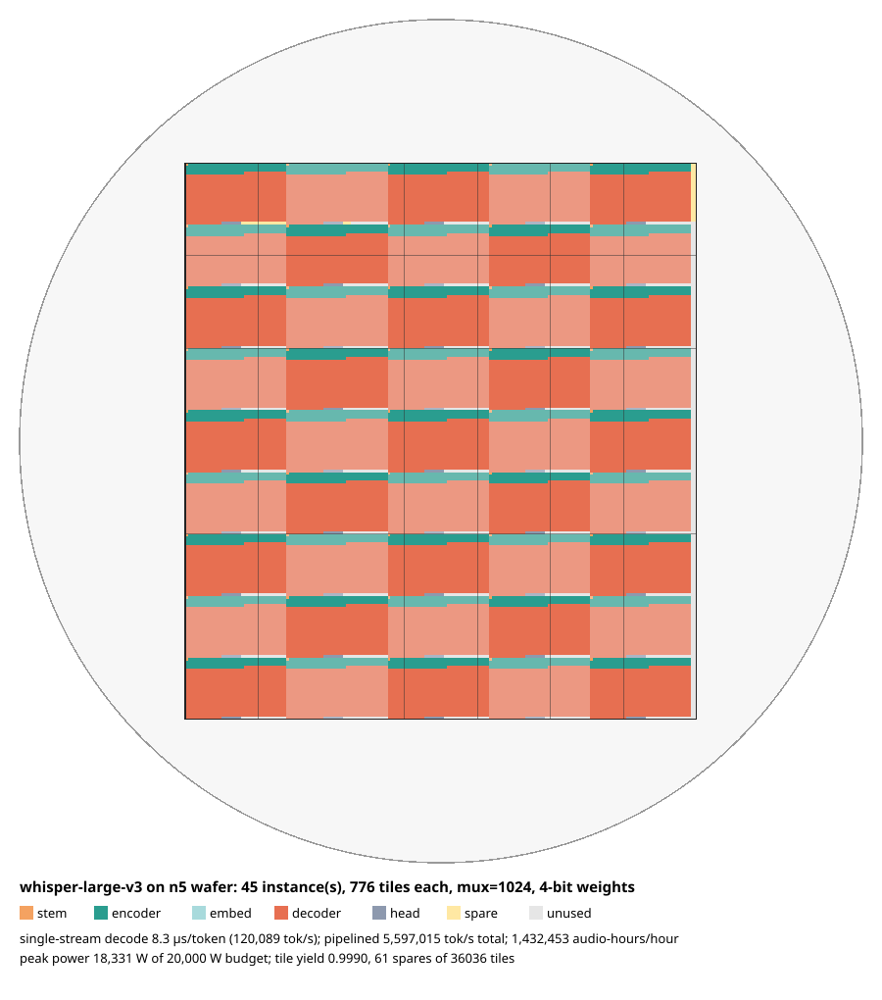

# wispr-on-chip

Planner for **wafer-scale fabrics with hardwired model weights**: the
"model etched into the silicon" approach Taalas demonstrated on a single die,
scaled to a stitched 300 mm wafer, with Whisper speech models as the first
workload.

Weights live in via/metal-programmed cells next to the multipliers that use
them, so there is no weight traffic, no HBM and no batching penalty. A wafer
holds dozens of complete copies of Whisper large-v3, or a few copies of an
8 B-parameter LLM. The planner takes a model and a fabric description and
reports area, packing, latency, throughput, power and yield, plus a floorplan.

See [`docs/ARCHITECTURE.md`](docs/ARCHITECTURE.md) for the hardware concept
and the assumptions behind every number.

## Install and run

Pure Python, no dependencies.

```bash
pip install -e .            # or: export PYTHONPATH=src
wispr-on-chip models        # model presets and parameter counts
wispr-on-chip processes     # process-node constants
wispr-on-chip plan --model whisper-large-v3 --ascii
wispr-on-chip plan --model whisper-large-v3 --svg floorplan.svg
wispr-on-chip plan --model llama-3.1-8b --process n6 --target die --weight-bits 3 --auto-mux --streams 1
wispr-on-chip sweep         # all Whisper sizes on one fabric
wispr-on-chip plan --model medium --json > plan.json
```

Tests: `pip install pytest && pytest`.

## Example: Whisper large-v3 on an N5 wafer

```
$ wispr-on-chip plan --model whisper-large-v3
== whisper-large-v3: 1,542 M params, 4-bit weights, 8-bit activations
target: 300 mm wafer, 7x6 stitched reticle fields (182 x 198 mm = 36,036 mm²), 20,000 W budget
process: n5 @ 1.1 GHz; tile 1 mm², mux=1024, 1024 KiB SRAM, 182x198 = 36,036 tiles
tile budget: 9.92 M weights + 9,685 MACs per tile (area: weights 0.36, macs 0.23, sram 0.26, overhead 0.15 mm²)
yield: tile yield 0.9990 at D0=0.1/cm²; expect 36.0 dead, reserve 61 spares -> 35,975 usable tiles

mapping: 776 tiles (776 mm²) per instance, packed as 36x22 blocks -> 45 instance(s) [FITS], fabric 97% used

  stage         kind         params  tiles   bound      MACs  cyc/item  cyc/window  sram%
  stem          stem         7.33 M      1 weights    9.69 k       686   1,029,000     1%
  enc0..enc31   encoder     19.66 M      4    sram   38.74 k       691   1,036,684    92%
  dec0..dec31   decoder     26.21 M     20    sram  193.70 k       253      48,122    95%
  head          head        66.96 M      7 weights   67.80 k     1,072      96,480     1%

performance (per instance unless noted):
  decode: 8.3 µs/token single stream = 120,089 tok/s
  encoder: 31.09 ms per 30 s window; 1,061.1 windows/s pipelined
  single stream: 32.58 ms per window = 921x real time
  total (45 inst.): 1,432,453 audio-hours per hour sustained in power budget

power:
  peak dynamic 16,530 W + leakage 1,802 W = 18,331 W vs budget 20,000 W
```

The headline finding: for Whisper the *KV cache*, not the weights, sizes the
fabric. Weights fill under a fifth of the tiles; the rest is SRAM holding
cross-attention K/V for the 30 s window. `--kv-bits 4`, a larger tile with
more SRAM, or an SRAM-rich tile variant are the levers.



## Whisper sizes on the same fabric

```
$ wispr-on-chip sweep
model                       params tiles/inst  inst  µs/tok tok/s 1-str x realtime   audio-h/h   peak W  sust. W
whisper-tiny               37.71 M         20  1782     1.7     596,871     17,539  70,091,183   45,029   20,000
whisper-base               72.50 M         40   891     2.2     462,002      9,303  32,340,575   35,606   20,000
whisper-small             241.46 M        114   308     4.0     252,706      3,867   9,203,046   34,699   20,000
whisper-medium            763.14 M        367    91     6.6     151,143      1,350   2,995,369   21,302   20,000
whisper-large-v3            1.54 G        776    45     8.3     120,089        921   1,432,453   18,331   18,331
whisper-large-v3-turbo    808.29 M        156   230     3.4     293,496        944   1,806,983   75,536   20,000
```

## Calibration

A single 815 mm² N6 die with 3-bit weights holds Llama 3.1 8B at mux≈1,700
and decodes ~14,000 tokens/s for one stream, in the same range as the figure
publicly reported for Taalas's first chip. The same constants are then used
for the wafer, so the wafer numbers inherit that calibration and its
uncertainty.

## Layout

```
src/wispr_on_chip/
  models.py     model presets; per-stage parameter, MAC and KV accounting
  process.py    process-node constants (density, energy, clock)
  fabric.py     tile budget, wafer/die targets, yield and redundancy
  mapper.py     stage placement, stream balancing, packing, performance, power
  floorplan.py  ASCII and SVG floorplans
  cli.py        command-line interface
docs/ARCHITECTURE.md   the hardware concept and modelling assumptions
tests/                 pytest suite
```

All physical constants are first-order public estimates and are meant to be
overridden as real tile measurements become available.
